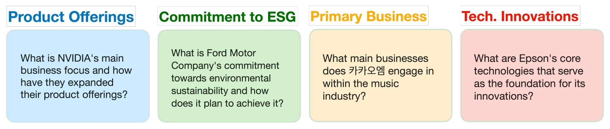

# Krx-Bench 2024

- KRX-Bench 경진대회는 참가자들이 KRX-Bench 파이프라인으로 생성된 벤치마크 데이터셋에서 고득점을 목표로 금융 특화 언어 모델을 자체적으로 개발하는 대회입니다. 이번 대회의 핵심인 벤치마크 리더보드 데이터셋은 KRX-Bench 벤치마크 생성 파이프라인을 통해 만들어졌습니다. KRX-Bench 파이프라인은 OneLineAI와 KRX에서 공동으로 작업한 [KRX-Bench: Automating Financial Benchmark Creation via Large Language Models](https://aclanthology.org/2024.finnlp-1.2.pdf) 논문에서 제안된 파이프라인으로, LREC-COLING 2024 FinNLP에서 발표되었습니다.

### **Research**

- 위 도구는 LLM을 활용하여 금융 관련 작업을 평가하는 벤치마크를 만들기 위해서 개발

- KRX-Bench로 벤치마크 Dataset을 만들고나서 이 도구를 이용해서 KRX-Bench-POC라는 벤치마크 Dataset을 생성

### **Purpose**

- 재무 보고서(Finance-realted tasks)에서 정보를 추출하여 LLM이 금융 분야에서의 지식을 평가합니다. 이로서 미국, 일본, 한국의 주식 시장에서 기업들에 대한 이해도를 평가할 수 있는 질문을 생성

- 금융 분야에서 LLM의 신뢰성에 대한 우려를 해결하기 위해 설계된 `자동 벤치마크 생성 파이프라인`

### **Key Features**

1. GPT-4-Turbo (LLM)을 사용하여 재무 보고서에서 질문을 생성(벤치마크 생성). 그리고 금융에 관련된 LLM을 평가하는데 사용

    - 금융문서를 통해 데이터 생성

    - BM25 Algorithm을 이용하여 다지선다형 문제에서 오답 선택지를 생성

    - 답변이 불가능한 질문을 제거하여 품질 유지

2. 그리고 효과를 검증하기 위해 KRX-Bench-POC라는 벤치마크 Dataset을 생성하여 테스트를 진행

    - 미국, 일본, 한국의 연간 보고서를 기반으로 생성

    -  총 1003개의 질문

    - 15개의 다양한 카테고리 (주요사업, 회사 미션 등)으로 구성

        

3. 성능 평가

    - 최신 오픈소스 LLM도 80% 미만의 성능을 기록하여 개선의 여지를 보여줌

    - 특히 미국 기업과 관련된 질문에서 더 높은 성능을 보임

        한국 및 일본 기업들은 영어로된 문서가 상대적으로 적기 때문에 어쩔 수 없는 결과로 보임

### 대회의 목표

- 벤치마크란, 특정 모델이나 시스템의 성능을 평가하기 위한 기준 혹은 테스트를 의미합니다. 위 논문에서 나온 `KRX-Bench-POC` 벤치마크는 

- LLM이 금융 데이터 기반으로 얼마나 잘 문제를 해결할 수 있는지 평가하는 기준을 제공하는 것입니다. 이를통해 내가 만든 LLM 모델이 얼마나 복잡한 금융 데이터를 잘 이해하고 처리하는지 검증이 가능합니다

- 그러므로 내가만든 LLM이 제공받은 문제를 풀었을 때, 고득점이 나오도록 개발해야 한다
